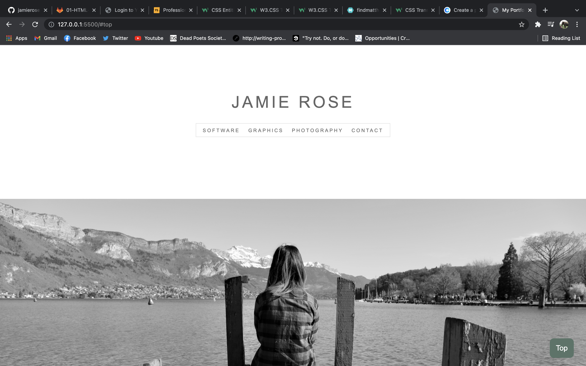
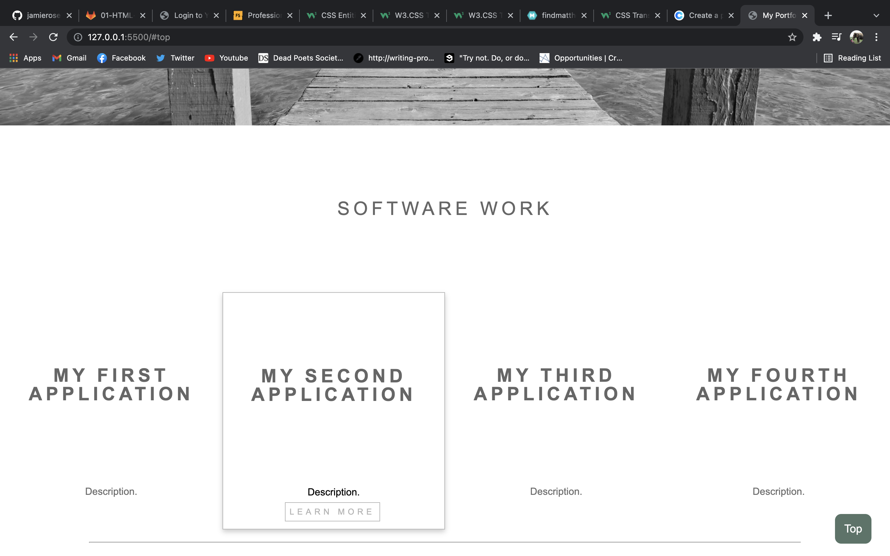
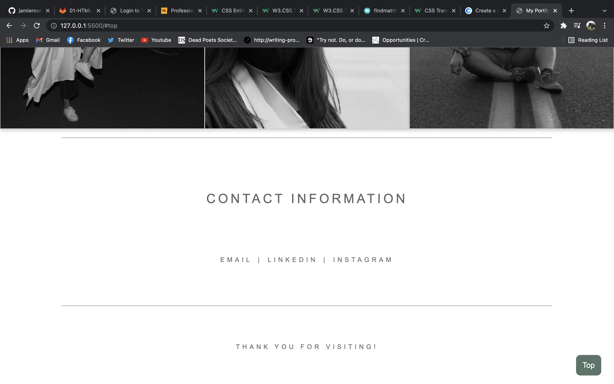

# my-portfolio

## Description

Created a portfolio that will showcase my future webpages and applications. I have also included sections on other things that I do, such as photography and graphic design.

## User Story
Use the navigation bar to jump to certain parts of my portfolio (About Me, Projects, Graphics, Photography, Contact). On desktops and laptops, hovering the mouse over images will reveal either color and/or links. Once done with a section, use the "top" button on the bottom right hand corner to jump back to the navigation bar.

## Deployed Site
https://jamierose528.github.io/my-portfolio/

## Contact
github: @jamierose528 
 
email: jamie.rose.528@gmail.com

## Screenshots

